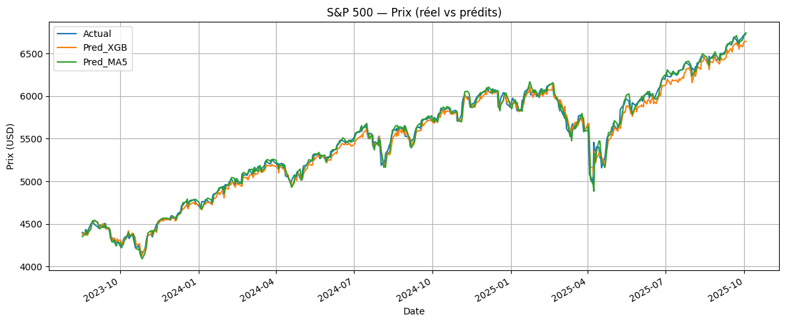
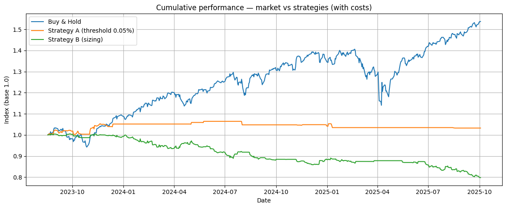

# 📈 S&P 500 Forecasting with Machine Learning (*personal project*)

This project builds a reproducible **next-day price prediction model** for the **S&P 500 index** using public financial data from Yahoo Finance.  
It combines feature engineering, time-series modeling (XGBoost), and an independent backtest to illustrate the gap between predictive accuracy and market performance.

---

## Overview

| File | Description |
|------|--------------|
| [`sp500_model.ipynb`](./sp500_model.ipynb) | Builds and evaluates the ML model (data loading, feature engineering, model training, metrics, and next-day prediction). |
| [`sp500_backtest.ipynb`](./sp500_backtest.ipynb) | Independent simulation of basic trading strategies using the model’s predictions (educational purpose only). |
| [`/data`](./data) | CSV exports generated by the model and used by the backtest notebook. |
| [`/assets`](./02_Assets) | Visual outputs used in this project. |

---

## Methodology

1. **Data Collection** — Yahoo Finance data for:
   - S&P 500 (^GSPC)
   - Volatility Index (VIX)
   - U.S. 10-year Treasury yield (TNX)
   - Brent crude oil (BZ=F)
   - Gold (GC=F)

2. **Feature Engineering**
   - Technical indicators: SMA, EMA, RSI, MACD, Bollinger Bands.
   - Lagged returns and volatility metrics.
   - Exogenous changes in macro indicators.

3. **Modeling**
   - Algorithm: `XGBoost Regressor`
   - Target: next-day return (`t+1`)
   - Evaluation metrics: MAE, RMSE, MAPE, Directional Accuracy.
   - Baselines: zero return & 5-day moving average.

4. **Backtesting (educational only)**
   - Strategy A: threshold on predicted return.
   - Strategy B: proportional exposure (sizing).
   - Volatility filter using VIX and transaction costs.

---

## 📈 Key Results

| Model | MAE | RMSE | MAPE (%) | Direction Accuracy |
|--------|------|-------|-----------|--------------------|
| XGBoost | 53.6 | 68.7 | 0.97 | 44.6% |
| MA(5) | 39.3 | 58.4 | 0.72 | 52.0% |
| Naive | 35.7 | 53.3 | 0.66 | 42.3% |

> *The model captures market trends but remains slightly below a simple moving average in directional accuracy.*  
This is expected given the high volatility and noise in daily financial data.

# *Predicted vs Actual S&P 500 Prices*

> The orange and green lines show the model predictions compared to real prices (blue).  
While the XGBoost model reproduces the general trajectory, some lag remains visible during market shocks — typical for short-term regression on financial data.

# *Feature Importance (XGBoost)*

| Feature | Importance |
|----------|-------------|
| VIX | 0.0446 |
| Ret_1d_lag3 | 0.0418 |
| TNX | 0.0399 |
| EMA_12 | 0.0362 |
| AdjClose | 0.0356 |
| AdjClose_lag1 | 0.0349 |
| Ret_1d | 0.0327 |
| SMA_5 | 0.0326 |
| TNX_ret1 | 0.0324 |
| RSI_14 | 0.0311 |
| BRENT | 0.0305 |
| VIX_ret1 | 0.0304 |
| Ret_5d | 0.0302 |
| BRENT_ret1 | 0.0302 |
| Ret_std_5 | 0.0297 |
| GOLD | 0.0295 |
| Vol_5 | 0.0284 |
| MACD | 0.0280 |
| BB_H | 0.0269 |
| Ret_mean_3 | 0.0266 |

The model gives the most weight to:
- **VIX** (volatility index),
- **TNX** (US 10-year yield),
- **Recent lags of returns and moving averages**,  
confirming that market momentum and volatility strongly drive daily fluctuations.

---

## Backtest — Cumulative Performance

📊 View backtest performance 

The backtest compares:
- **Buy & Hold (blue):** market performance,
- **Strategy A (orange):** threshold-based signals,
- **Strategy B (green):** dynamic position sizing.

While the model reproduces price movements, it does not outperform the market in this simple form — consistent with efficient market theory.

</details

---

## Interpretation

 **What this shows**
- The model accurately tracks the S&P 500's movements, with an average relative error below 1% over the test period.
- Predicting the next-day return (rather than the absolute price) makes the series more stationary, improving model stability and generalization (validated by walk-forward CV).

** Limitations (scope of the project)**
- On a broad, efficient index like the S&P 500, predictive signals are naturally weak and rarely translate into consistent outperformance once transaction costs are included.
- The project’s goal is to demonstrate a robust ML workflow — from data collection to modeling and evaluation — rather than to design a trading strategy.

---

## Tech Stack

- **Python 3.10+**
- `pandas`, `numpy`, `matplotlib`
- `yfinance` for financial data
- `xgboost` and `scikit-learn` for modeling
- `ta` for technical indicators

---

## License
MIT – Free to use and share with attribution. 

